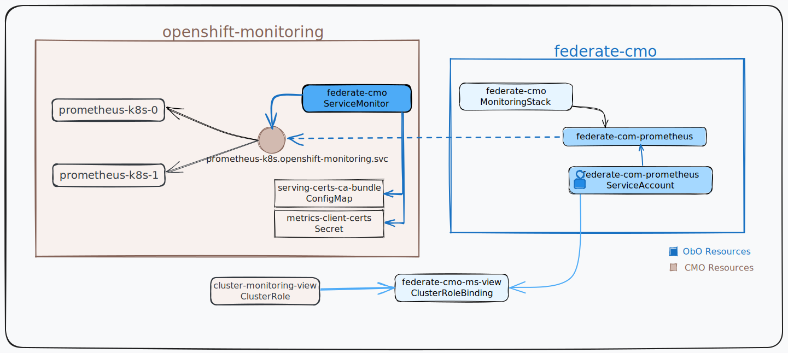

# Federate Monitoring Stack and Openshift In-Cluster Prometheus

## Architecture / Topology

This example deploy a MonitoringStack in `federate-cmo` namespace and reads
only a selected set of metrics from the in-cluster prometheus.

## Steps

### Deploy Monitoring Stack

### Grant permission to Federate In-Cluster Prometheus

### Create ServiceMonitor for Federation

## Validation
